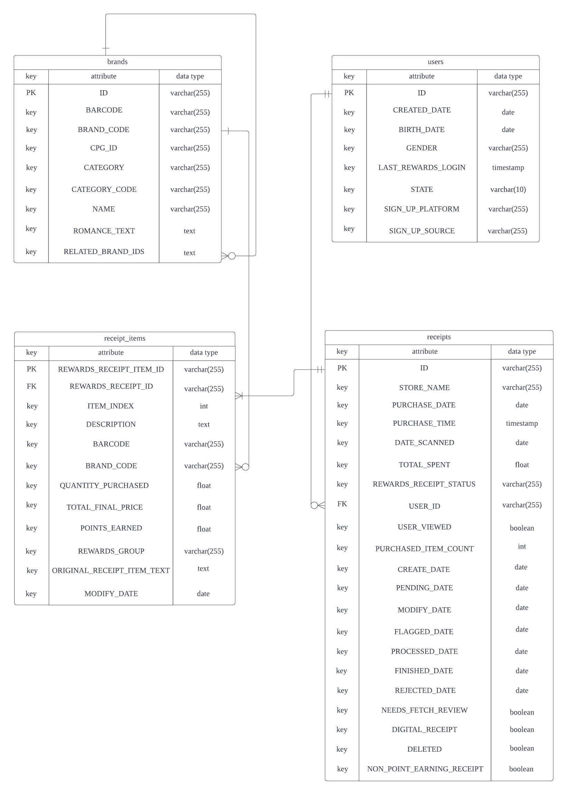
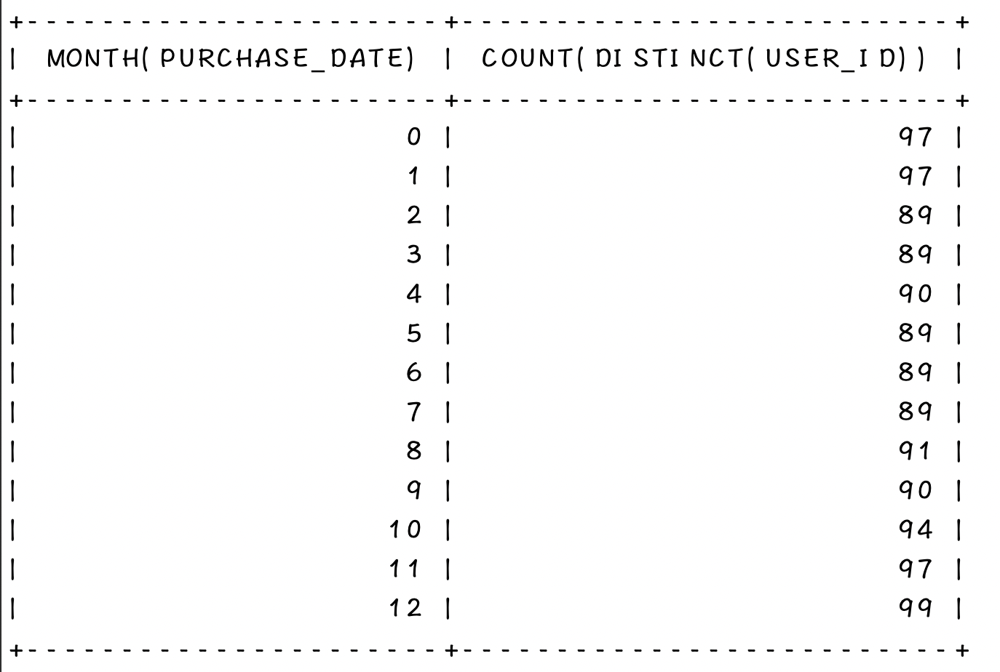
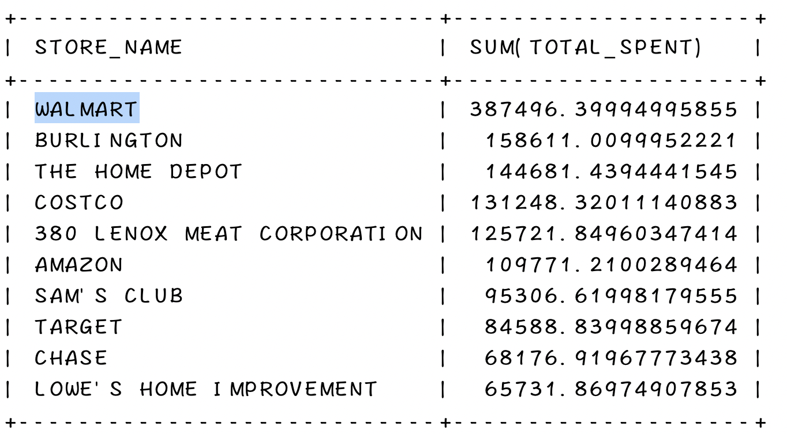
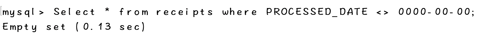
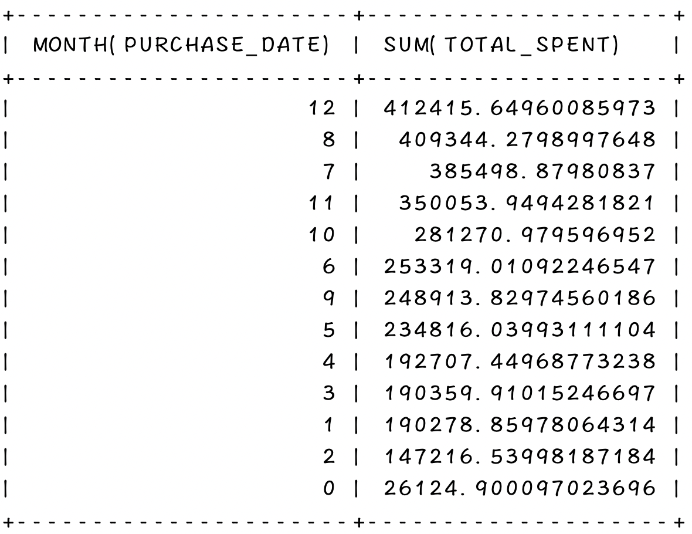

# Fetch-Data-Analytics
## Structured Relational Data Model

## SQL query(s)
- SQL dialect: MySQL
- The commands for creating the tables are in table.sql
- Query commands can be found in analyze.sql
1. Which brand saw the most dollars spent in the month of June?
    - Answer: BRAND_CODE = KIRKLAND SIGNATURE
2. Which user spent the most money in the month of August?
    - Answer: USER_ID = 609ab37f7a2e8f2f95ae968f
3. What is the name of the most expensive item purchased?
    - Answer: DESCRIPTION = Starbucks Iced Coffee Premium Coffee Beverage Unsweetened Blonde Roast Bottle 48 Oz 1 Ct

4. What user bought the most expensive item?
    - Answer: USER_ID = 617376b8a9619d488190e0b6

5. How many users scanned in each month?
    - Answer: ("0" means the month the user is scanned is unknown)
    

## Noteworthy Observation
### The SQL commands used for analysis are in analyze.sql
1. The most money is spent in Walmart.

2. There is no data for processed date for receipts.

3. Total spent of December is about 3 times of February.
 - ("0" means the month the user made the purchase is unknown)

